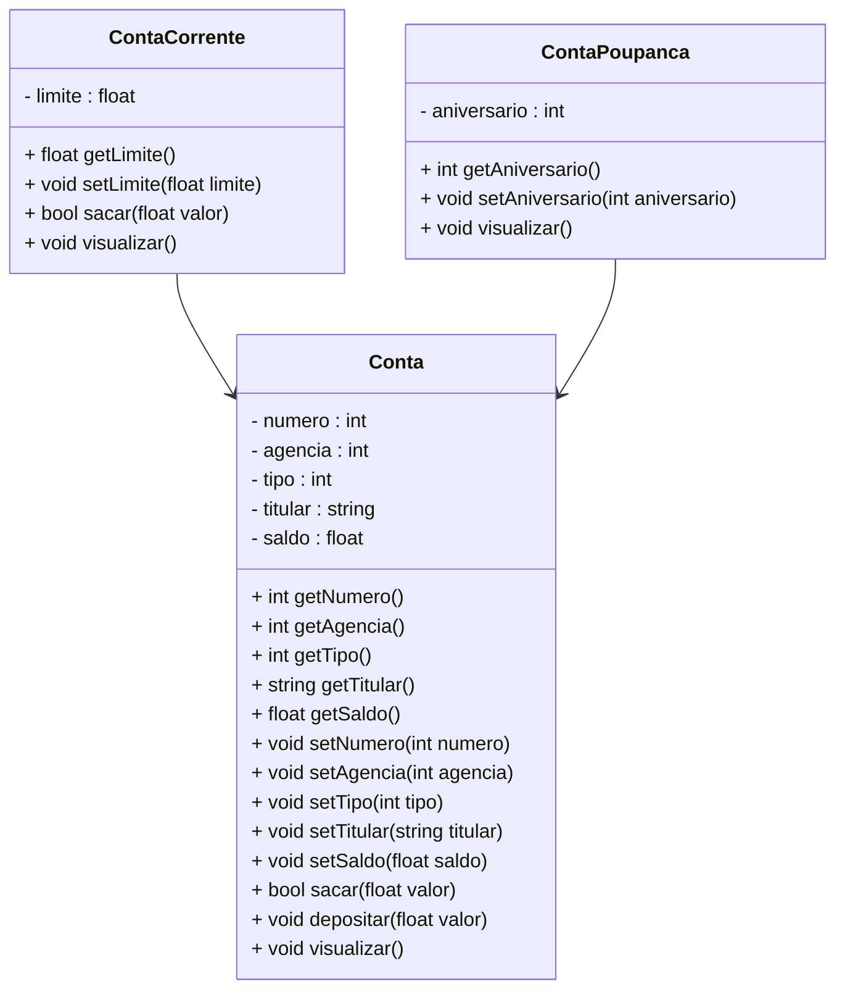

# Projeto Conta Bancária - POO - Typescript

 

   

  

## Diagrama de Classes

  

## Bibliotecas

- npm install -g typescript
- npm install -g ts-node
- npm install prompt-sync
- npm install @types/prompt-sync
- npm install --save-dev @types/node
- npm install readline-sync

  

## Executar o projeto

1. Abra o Terminal
2. Digite o comando: `tsc --init` na pasta raíz do projeto
3. Para executar o projeto, utilize o comando `ts-node Menu.ts`

  

## Print da Tela

   

